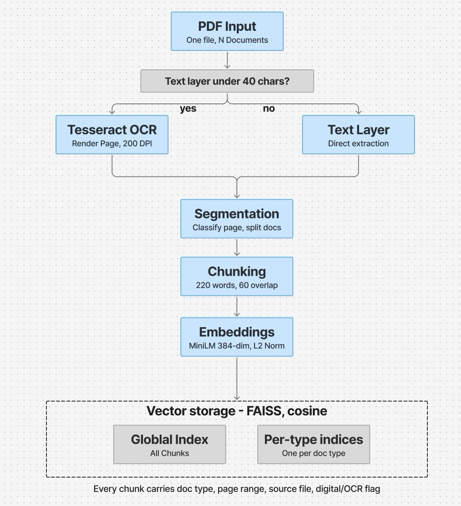
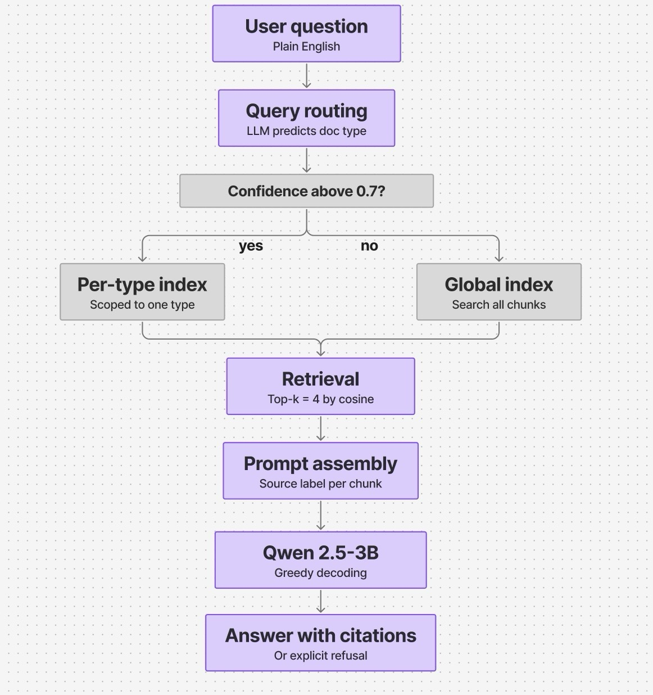

# Pharmaceutical Document Q&A

A retrieval-augmented generation pipeline that reads bundled pharmaceutical PDFs, splits them into their constituent documents, and answers plain-English questions with citations to the exact source page.

Built for **Pfizer's AI-Powered Document Insights and Data Extraction Externship**.

**[Demo video](https://www.loom.com/share/db16d716a4784a97bf3e5bf9d9248b95)**

---

## The problem

Supplier documentation in pharma typically arrives as a single "blob" PDF: a Cover Letter, a Certificate of Quality, a Packaging Specification and several other documents concatenated back to back, with nothing marking where one ends and the next begins.

The 10-page example bundle in this repo contains:

| Document                      | Pages | Contents                                               |
| ----------------------------- | ----- | ------------------------------------------------------ |
| Cover Letter                  | 1     | Storage and handling conditions                        |
| Certificate of Quality (×2)   | 2–3   | Lot numbers, dates, release criteria                   |
| Packaging Specification       | 4–5   | Materials, part numbers, revision history              |
| BSE/TSE Declaration           | 6     | Animal-origin compliance statement                     |
| Material Description Sheet    | 7     | Materials of construction, sterilization compatibility |
| Supplier Qualification Record | 8–9   | Audit history, ISO certifications                      |
| Chain of Custody              | 10    | Manufacturing site, distribution flow                  |

Answering a single compliance question — _"is this free of animal origin, and what is it made of?"_ — requires locating two separate documents and cross-referencing them by hand. In a regulated setting the answer alone is insufficient: it has to be traceable to a specific page for audit.

Some of these documents arrive as scans with no selectable text.

---

## What it does

```
PDF in → OCR if needed → segment into documents → chunk → embed → store → retrieve → answer with citation
```

**On ingestion**, each page is checked for readable text. Pages without it are rendered and passed through Tesseract OCR. Once text is available, the pipeline determines where each sub-document begins and ends, splits the text into overlapping chunks, and stores them in two places: one index covering everything, and a separate index per document type.

<p align="center">
  
</p>

**On a question**, the model first predicts which document type is likely to hold the answer. Above a confidence threshold it searches only that document type's index; below it, it searches everything. Retrieved passages are labelled with their source before the model sees them, so citations can be verified automatically.

<p align="center">
  
</p>

Four things worth noting:

- **It segments the bundle itself.** No hardcoded page ranges. An LLM reads each page and decides whether it continues the previous document or starts a new one.
- **Scans and digital PDFs follow the same path.** Anything with almost no extractable text is OCR'd first, then joins the pipeline as normal.
- **It declines when the answer isn't there.** If the retrieved text doesn't support an answer, the model is instructed to say so rather than guess. This mostly works — see the results below.
- **Everything runs locally.** No API key, no data leaving the machine, which matters when the documents are under NDA.

---

## Stack

Standard components, deliberately:

- **OCR:** Tesseract, triggered only when a page has almost no extractable text
- **Chunking:** sliding window, ~220 words with overlap, never spanning two sub-documents
- **Embeddings:** `all-MiniLM-L6-v2` — small, fast, sufficient at this scale
- **Vector search:** FAISS, cosine similarity, exact search
- **LLM:** Qwen2.5-3B-Instruct, local, greedy decoding for reproducibility
- **UI:** Gradio — upload a file, view how it was segmented, ask questions

---

## Results

Evaluated on 4 documents, 26 pages and 17 questions — some answerable, four deliberately not, to test whether the system would admit it.

| Metric                                    | Score |
| ----------------------------------------- | ----- |
| Answer accuracy                           | 81%   |
| Correct refusal on unanswerable questions | 100%  |
| Cited the right source                    | 100%  |
| No fabricated citations                   | 100%  |
| Correct chunk retrieved in top 3          | 91%   |
| Average response time                     | ~4.7s |

### The interesting finding

**Every error was an over-refusal, not a fabrication.** In four of the five failures the system retrieved the _correct_ document and then replied that the provided documents didn't contain enough information — when the answer was in the context window.

The same instruction that makes it reliable at admitting genuine gaps is also causing it to decline questions it could answer. For a compliance setting, "too cautious" is the better failure mode than "confidently wrong," but it's a real cost and the first thing worth fixing.

Full per-question results are in [`results/results.md`](results/results.md).

---

## Repo layout

```
├── notebooks/
│   ├── 01_pipeline_and_demo.ipynb   # pipeline + Gradio app — start here
│   └── 02_evaluation.ipynb          # how the numbers above were measured
├── data/
│   ├── pharma-blob-sample.pdf       # 10-page example, all 7 doc types
│   ├── sample-sdf-document.pdf      # shorter 3-page example
│   └── ground_truth.json            # answer key used for evaluation
├── results/
│   ├── results.md                   # every question and answer, in full
│   └── metrics.json                 # headline numbers
└── docs/
    ├── ingestion.jpeg               # diagram: document processing
    └── query.jpeg                   # diagram: question answering
```

---

## Running it

**In Colab:**

1. Open `notebooks/01_pipeline_and_demo.ipynb`
2. Switch the runtime to a T4 GPU (Runtime → Change runtime type)
3. Run all cells — the model download takes a few minutes
4. Open the Gradio link at the bottom, upload a PDF from `data/`, click Process, and ask questions

It runs on CPU without a GPU, at roughly 20–60 seconds per answer instead of a few. Swapping the model for `Qwen2.5-1.5B-Instruct` roughly halves that, at some cost to quality.

To reproduce the evaluation: upload both PDFs and `ground_truth.json`, then run `02_evaluation.ipynb`. Takes 20–35 minutes on a T4.

**Two questions worth trying:**

- _"What is the lot number and expiration date for the AKTA ready Low Flow Kit?"_ — straightforward on the surface, but there are two Certificates of Quality in the file, so the retriever has to select the right one.
- _"What is the lot number and expiration date for part number 29477427?"_ — this part number appears throughout the bundle, but its Certificate of Quality is missing from this particular file. The correct response is to say it can't be found, rather than taking a lot number from a neighbouring certificate.

---

## Limitations

- **The evaluation set is small.** 4 documents, 17 questions. Some figures — Recall@3 in particular — look stronger than they would on a larger, messier corpus, because with this few chunks the retriever has little to distinguish between.
- **The "scanned" documents are synthetic.** They're the digital PDFs re-rendered as images, so OCR has an easier time than it would with a genuine scan involving skew, stamps or handwriting.
- **Routing selects one document type at a time.** Questions spanning two documents will usually only search one of them. In one observed case the system answered the second half from prior knowledge and cited a document that doesn't contain that claim. Every automated check passed; a human reading the citation would have caught it.
- **The factual-accuracy metric is self-graded.** The same model that answers the question also judges whether the answer was accurate. Treat that figure as a rough signal, not an audit.
- **It isn't deployable as-is.** No persistence, no authentication, and every document is reprocessed per session. This is a working prototype from a 10-week externship.

---

## Next steps

Roughly in order of effort:

- Add keyword matching before LLM classification — the document titles are consistent enough that this should catch easy misclassifications cheaply
- Search the top _two_ predicted document types rather than one, to address cross-document questions
- Loosen the refusal behaviour, which currently errs too far toward caution
- Longer term: an independent (not self-graded) accuracy check, a larger and messier test set, and persistent storage so the corpus isn't rebuilt each session

---

## Notes

The sample documents are publicly available Cytiva product documentation, used here for demonstration only. The seven document types are defined in one place (`VALID_DOC_TYPES`), so pointing this at a different kind of bundle is mostly a matter of editing that list and the classification prompt.

Requires **Gradio 6** — the `Chatbot` component and the placement of `theme` both changed, and older versions will error.
